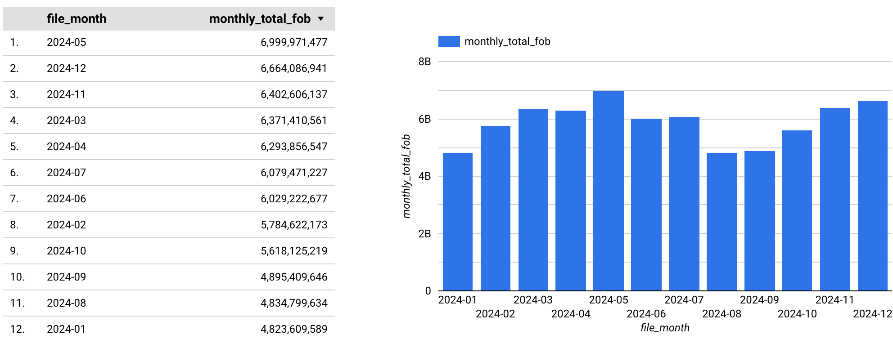
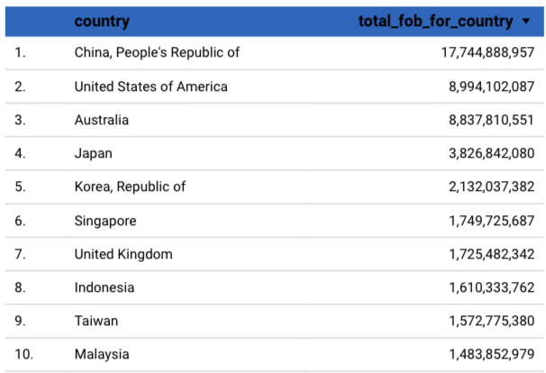
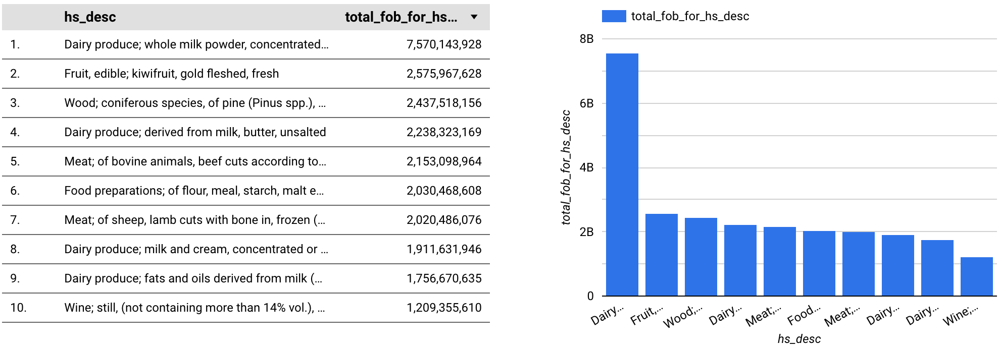

# Analysis of New Zealand's 2024 Export Data using BigQuery and SQL

## Summary

This project involves analyzing New Zealand's monthly export data for the year 2024. The data was downloaded, loaded into BigQuery, and then analyzed using SQL. 
The primary purpose of this analysis is to identify New Zealand's main export destination countries and key export commodities.

## Data Used

- Data Source: Stats NZ "Overseas merchandise trade datasets"
- Period: January 2024 - December 2024 
- Key Columns: country (destination country), hs_desc (commodity description), total_export_FOB (total export Free On Board value), month, etc.

## Tools and Platforms Used

- Google BigQuery
- SQL

## Analyse process

1.  **Data Loading:** Monthly export data for all 12 months of 2024 (in CSV format) was loaded into separate monthly tables in BigQuery.
  
2.  **Data Aggregation:** The following SQL query was used to create a consolidated view named `all_exports_2024`, which combines the data from all 12 monthly tables.
   

 
```sql  
CREATE OR REPLACE VIEW `elegant-rock-451218-q4.nz_exports.all_exports_2024` AS
SELECT *, '2024-01' AS file_month FROM `elegant-rock-451218-q4.nz_exports.exports_2024_01`
UNION ALL
SELECT *, '2024-02' AS file_month FROM `elegant-rock-451218-q4.nz_exports.exports_2024_02`
UNION ALL
SELECT *, '2024-03' AS file_month FROM `elegant-rock-451218-q4.nz_exports.exports_2024_03`
UNION ALL
SELECT *, '2024-04' AS file_month FROM `elegant-rock-451218-q4.nz_exports.exports_2024_04`
UNION ALL
SELECT *, '2024-05' AS file_month FROM `elegant-rock-451218-q4.nz_exports.exports_2024_05`
UNION ALL
SELECT *, '2024-06' AS file_month FROM `elegant-rock-451218-q4.nz_exports.exports_2024_06`
UNION ALL
SELECT *, '2024-07' AS file_month FROM `elegant-rock-451218-q4.nz_exports.exports_2024_07`
UNION ALL
SELECT *, '2024-08' AS file_month FROM `elegant-rock-451218-q4.nz_exports.exports_2024_08`
UNION ALL
SELECT *, '2024-09' AS file_month FROM `elegant-rock-451218-q4.nz_exports.exports_2024_09`
UNION ALL
SELECT *, '2024-10' AS file_month FROM `elegant-rock-451218-q4.nz_exports.exports_2024_10`
UNION ALL
SELECT *, '2024-11' AS file_month FROM `elegant-rock-451218-q4.nz_exports.exports_2024_11`
UNION ALL
SELECT *, '2024-12' AS file_month FROM `elegant-rock-451218-q4.nz_exports.exports_2024_12`;
```

## Monthly Export Trends

To understand the export performance over time, an analysis of the monthly total export FOB value was conducted. 
This helps to identify any seasonal patterns or significant fluctuations in export revenue throughout the year 2024.

The following SQL query was used to retrieve the total export FOB value for each month:

```sql
SELECT
  file_month,                         -- Month (YYYY-MM format)
  SUM(total_export_FOB) AS monthly_total_fob -- Total export FOB value for the month
FROM
  `elegant-rock-451218-q4.nz_exports.all_exports_2024` -- Aggregated view
GROUP BY
  file_month                          -- Aggregate by month
ORDER BY
  file_month ASC;                     -- Order by month chronologically
```
Key Findings:
The analysis revealed that export values peaked in May and December, while the lowest export values were observed in August and January.




## Top 10 Export Destinations

Identifying the primary countries to which New Zealand exports its goods is crucial for understanding its key trading partners. This analysis pinpoints the top 10 export destination countries based on the total Free On Board (FOB) value for the year 2024.

The following SQL query was used to determine these top 10 countries:

```sql
SELECT
  country,                         
  SUM(total_export_FOB) AS total_fob_for_country 
FROM
  `elegant-rock-451218-q4.nz_exports.all_exports_2024` 
GROUP BY
  country                           
ORDER BY
  total_fob_for_country DESC        
LIMIT 10;
```
Key Findings:
The top 10 export destinations for New Zealand in 2024 were:



A key finding from this analysis is that China is by far the largest export destination, with a total export FOB value more than double that of the next leading countries, the United States and Australia.


## Top 10 Export Commodities

This part of the analysis focuses on determining the top 10 export commodities based on their total Free On Board (FOB) value in 2024.

The following SQL query was used to identify these leading commodities:

```sql
SELECT
  hs_desc,                            -- Commodity description (from HS code)
  SUM(total_export_FOB) AS total_fob_for_hs_desc -- Total export FOB value for the commodity
FROM
  `elegant-rock-451218-q4.nz_exports.all_exports_2024` -- Aggregated view
GROUP BY
  hs_desc                             -- Aggregate by commodity description
ORDER BY
  total_fob_for_hs_desc DESC          -- Order by total FOB value
LIMIT 10;                             -- Limit to the top 10 commodities                          
```
Key Findings:
The analysis highlighted the following as the top 10 export commodities for New Zealand in 2024:



Among these, a particularly significant finding is that whole milk powder, a key dairy product, stands out as New Zealand's foremost export commodity. Its export value was exceptionally high in 2024, exceeding three times the value of any other single leading commodity.

## Conclusion

This analysis of New Zealand's 2024 export data using BigQuery and SQL provided valuable insights into its trade patterns. Key takeaways include the identification of China as the dominant export market and whole milk powder as the leading export commodity by a significant margin. Furthermore, monthly trend analysis revealed peak export months in May and December. While this analysis was based on a straightforward aggregation of the available data, it successfully highlighted major characteristics of New Zealand's export landscape in 2024.

## Limitations

**External Factors:** The impact of global economic conditions, trade agreements, or specific geopolitical events on export figures was not explicitly analyzed.

## Future Work / Potential Further Analysis

*   **Advanced Statistical Analysis:** Employ statistical methods to identify correlations or build predictive models for export demand.
*   **Data Cleaning and Standardization:** Implement more robust data cleaning processes, including standardization of country names, for more precise results.
*   **Interactive Dashboard:** Develop an interactive dashboard (e.g., using Looker Studio or other BI tools) to allow for more dynamic exploration of the data.


                    
